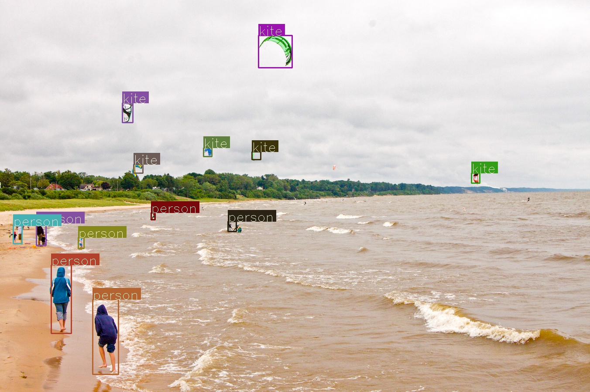

# YOLOv3
Pytorch implementation of real time object detection algorithm YOLOv3

Guided by [YOLOv3 Pytorch implementation tutorial](https://blog.paperspace.com/how-to-implement-a-yolo-object-detector-in-pytorch/)
but has a better style and structure in my opinion

To run this detection algorithm, after cloning the repo, download pretrained weights by the authors to the repo directory
[here](https://pjreddie.com/media/files/yolov3.weights) or by

```
wget https://pjreddie.com/media/files/yolov3.weights
```

## Requirements

- Pytorch 0.4
- OpenCV 3.4

## Usage

```
usage: detector.py [-h] -i INPUT [-t OBJ_THRESH] [-n NMS_THRESH] [-o OUTDIR]
                   [-v] [-w] [--cuda] [--no-show]

YOLOv3 object detection

optional arguments:
  -h, --help            show this help message and exit
  -i INPUT, --input INPUT
                        input image or directory or video
  -t OBJ_THRESH, --obj-thresh OBJ_THRESH
                        objectness threshold, DEFAULT: 0.5
  -n NMS_THRESH, --nms-thresh NMS_THRESH
                        non max suppression threshold, DEFAULT: 0.4
  -o OUTDIR, --outdir OUTDIR
                        output directory, DEFAULT: detection/
  -v, --video           flag for detecting a video input
  -w, --webcam          flag for detecting from webcam. Specify webcam ID in
                        the input. usually 0 for a single webcam connected
  --cuda                flag for running on GPU
  --no-show             do not show the detected video in real time
```

To tune hyper parameters, change the cfg file.

#### Detecting on a image or a directory containing images

`python3 detector.py -i <input>`

Result will be save in \<outdir\>


demo




#### Detecting on a video or a webcam

- Video `python3 detector.py -i <input> -v`
- Webcam `python3 detector.py -v -w -i 0`

This will do object detection on the video or webcam(0 is the webcam ID. Change it if you have multiple webcam connected) and show the result in real time and save the detected video with bounding boxes flying around(without audio).

Note: Requires opencv. You might encounter a problem saying some function of opencv is not implemented.
Try searching for a solution and reinstall your opencv package if needed(That is what I did).
Add `--no-show` flag if you don't wanna see the result playing in real time or can't get opencv to work.

Note: Detection running on CPU is not fast enough to show the result in real time and you probably won't be able to see the video playing in normal speed.
But the saved video will be in normal speed for detecting on a video because it processes all the frames. For webcam however, the speed will be much faster because it loses frames.


## Reference
- Paper [YOLOv3: An Incremental Improvement](https://pjreddie.com/media/files/papers/YOLOv3.pdf)
- Paper [Website](https://pjreddie.com/darknet/yolo/)
- [Tutorial](https://blog.paperspace.com/how-to-implement-a-yolo-object-detector-in-pytorch/)
